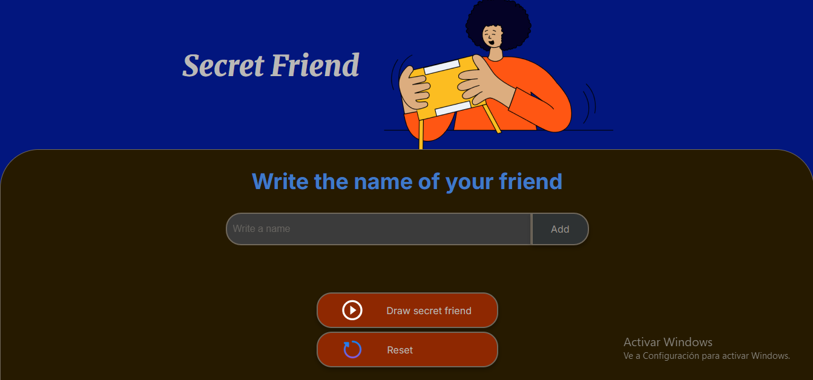

# 🎁 Secret Friend

A simple web application to play **Secret Friend**.  
It allows you to add friend's names, randomly draw one as the secret friend, and reset the game whenever you want.

---

## 📸 Preview



---

## ⚙️ Features

- ✍️ **Add friends**: type a name and add it to the list.  
- 🎲 **Draw a secret friend**: randomly selects one name from the list.  
- 🔄 **Reset game**: clears the friends list, the result, and the input field to start again.  
- 🛡️ **Validations**:
  - Empty names are not allowed.  
  - Duplicate names are not allowed.  

---

## 🗂️ Project structure


```bash
📂 secret-friend
 ┣ 📂 assets
 ┃ ┣ amigo-secreto.png
 ┃ ┣ play_circle_outline.png
 ┃ ┗ reiniciar.png
 ┣ 📜 index.html
 ┣ 📜 style.css
 ┣ 📜 app.js
 ┗ 📜 README.md
 ```

---

## 🚀 How to use

1. Clone this repository or download the files.  
2. Open the project in **VS Code** (or your favorite editor).  
3. Use the **Live Server** extension or simply open `index.html` in your browser.  
4. Start playing! 🎉  

---

## 🛠️ Built with

- **HTML5**  
- **CSS3**  
- **JavaScript (ES6)**  

---

## 🙌 Author

Created with ❤️ by Denisse González in collaboration with Alura Latam.  